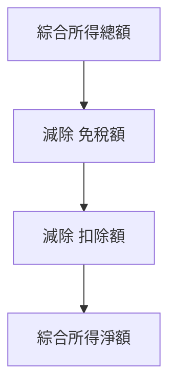

# 綜合所得淨額計算公式

**綜合所得淨額**是計算綜合所得稅的關鍵基礎，它代表了個人在扣除各項免稅額和扣除額後，實際應被課稅的所得金額。理解其計算公式，是掌握綜合所得稅的核心。

---

## 基本公式

綜合所得淨額的計算公式如下：

`綜合所得淨額 = 綜合所得總額 - 免稅額 - 扣除額`

### 各項組成要素說明

1.  **[[2. 綜合所得總額]]**：
    -   指納稅義務人本人、配偶及受扶養親屬，依《所得稅法》規定應稅的各類所得（如[[營利所得]]、[[薪資所得]]、[[利息所得]]、[[租賃與權利金所得]]等）的合計數。
    -   **注意**：採[[分離課稅]]的所得不計入綜合所得總額。

2.  **[[3. 免稅額]]**：
    -   指為保障納稅義務人及其受扶養親屬基本生活所需，而給予的定額減免。
    -   包含[[個人與配偶免稅額]]及[[扶養親屬免稅額]]。
    -   金額會因年齡（如70歲以上）而有不同。

3.  **[[4. 扣除額]]**：
    -   指在綜合所得總額中，依規定可以減除的各項支出。
    -   分為兩大類：
        -   **[[一般扣除額]]**：納稅義務人可選擇[[標準扣除額]]或[[列舉扣除額]]，擇一適用。
        -   **[[特別扣除額]]**：如[[薪資所得特別扣除額]]、[[儲蓄投資特別扣除額]]、[[身心障礙特別扣除額]]、[[教育學費特別扣除額]]、[[幼兒學前特別扣除額]]、[[長期照顧特別扣除額]]等，可與一般扣除額併用。

## 計算流程圖

## 範例

假設某單身納稅義務人：
-   全年薪資所得：800,000元
-   利息所得：10,000元
-   **綜合所得總額** = 800,000 + 10,000 = 810,000元

-   **免稅額** (單身未滿70歲) = 92,000元

-   **扣除額**：
    -   選擇[[標準扣除額]] = 124,000元
    -   [[薪資所得特別扣除額]] = 207,000元
    -   [[儲蓄投資特別扣除額]] (利息10,000元未達上限) = 10,000元
    -   **總扣除額** = 124,000 + 207,000 + 10,000 = 341,000元

-   **綜合所得淨額** = 810,000 (總額) - 92,000 (免稅額) - 341,000 (扣除額) = **377,000元**

這個377,000元就是接下來要套用稅率計算應納稅額的基礎。

## 關聯節點
- [[5. 稅率與計算]]
- [[課稅級距與累進稅率表]]
- [[應納稅額計算]]
